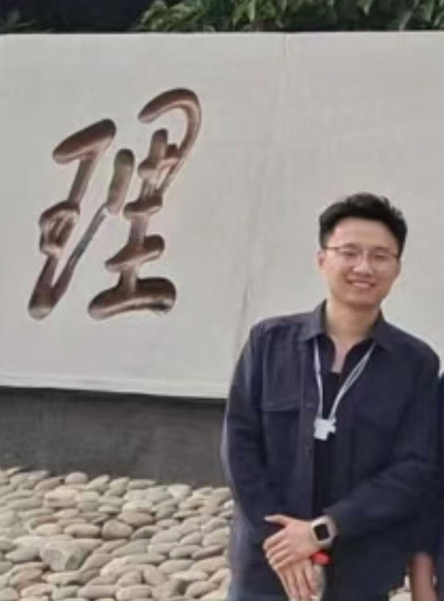

<table>
<tr>
<td width="400">
  
</td>
<td>

<h1>👋 Hi, I'm <strong>Haiguang Zhang (张海光)</strong></h1>

🎓 <b>M.Eng. in Computer Technology</b>, Dalian University of Technology  
 
📚 <b>NLP · Legal AI · Knowledge Graphs</b>  
 
✉️ <a href="mailto:maxwellzhg@gmail.com">maxwellzhg@gmail.com</a>  
 
🔗 <a href="https://scholar.google.com/citations?user=xIPk_pgAAAAJ&hl=en">Google Scholar</a> | <a href="https://github.com/MaxwellZhang7">GitHub</a>  
 
  
  

</td>
</tr>
</table>
---

## 🧠 About Me

I’m passionate about information extraction, large language models (LLMs), and their applications in legal NLP.  
My research focuses on building **explainable, robust AI systems** for legal decision-making — such as legal QA, NER, and relation extraction — to enhance fairness and efficiency in the judicial system.

I have authored papers in **AI Open (IF 14.8)** and **Applied Intelligence (IF 3.8)**, and aim to contribute open, transparent tools for interpretable AI.

---

## 🛠 Tech Stack

| **Languages & Frameworks** | **Core Topics** | **Tools** |
| :-------------------------- | :-------------- | :-------- |
| Python, PyTorch, Java, C/C++, HTML | NLP, Knowledge Graphs, Explainable AI, Legal Reasoning | Git, STM32, Photoshop, Origin |

---

## 🚀 Research Highlights

- 🔍 **BCA** – Bilinear CNNs + Attention for Legal QA | *AI Open*, First Author  
- 📊 **LegalATLE** – Active-Transfer Learning for Triple Extraction | *Applied Intelligence*, First Author  
- 🧩 **JurisGraph Engine** – LLM + Knowledge Graph for Judicial QA 
- 📚 **Master's Thesis** – Legal QA system using graphs from 8000+ cases & 483 charges

---

## 🧪 Projects

- **Judicial LLM Fine-Tuning @ DUT** – Fine-tuned LLMs on Chinese legal texts, improved precision by 12%.  
- **Legal Supervision Knowledge Graph** – Built large-scale legal KG with Dalian Procuratorate.  
- **Government Document Mining** – Crawled/analyzed 6000+ gov pages for structure extraction.  
- **Fatigue Detection System** – Mobile/web system using physiological signals; won software design awards.

---

## 🎤 Conferences & Talks

- 🏛 **The 11th SMP Conference – Social Media Meets Big Models**, 2023, Hefei

---

## 🏆 Honors & Awards

- 🥇 **First Prize** – National Mathematics Competitions (National & Provincial)  
- 🥈 **CAIL2021 Judicial QA Track** – 3rd Prize (National NLP Contest)  
- 🥇 **1st Prize (17th Shandong Provincial Software Design Competition)**  
- 🥈 **2nd Prize (18th Shandong Provincial Software Design Competition)**  
- 💡 **National College Innovation & Entrepreneurship Program** – National-level Funding  
- 📊 **Undergraduate Major Ranking: Top 5%**  
- 🎓 Excellent Student (×3), Outstanding Graduate, **Outstanding Class Cadre**, Outstanding League Member
- 💰 **National Endeavor Scholarship**, 6× Academic Scholarships

---

## 📚 Teaching & Leadership

- 🧑‍🏫 Teaching Assistant – Digital Logic @ DUT  
- 🎙 **Secretary General, Foreign Language Broadcasting Station** | **Outstanding Broadcaster**  
- 🌐 **Campus Guide – Outstanding Docent ("Old Villa" Museum)**  
- 🌐 Campus Guide & Interpreter for Nobel Laureates

---

## 🤝 Memberships

- **Student Member, CCF (China Computer Federation)**

---

## 🗣 Languages & More

- **Languages:** Mandarin (Native), English (Fluent, IELTS 7.0)  
- **Hobbies:** 🏃 Running · 🚴 Cycling · 💪 Pull-ups  
- **Traits:** Diligent · Practical · Persistent

---

  ⭐️ <em>Feel free to connect with me or explore my projects here on GitHub!</em> ⭐️

